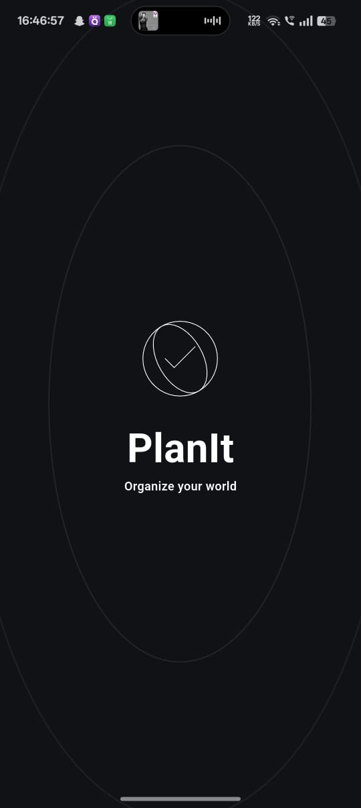
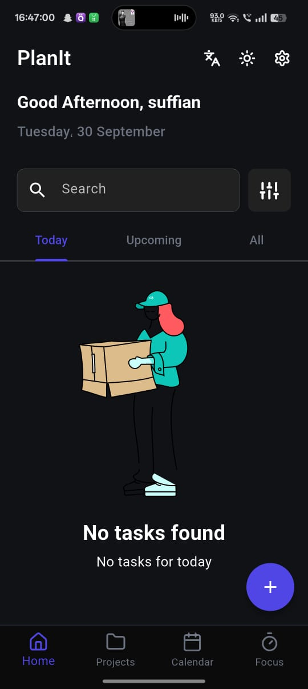
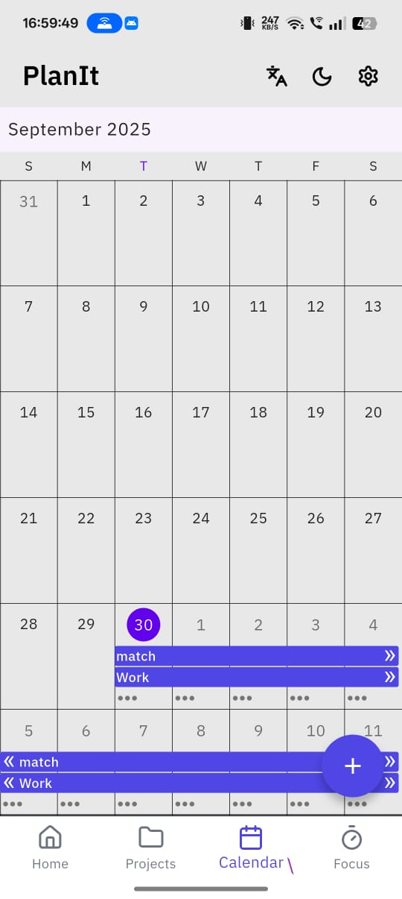
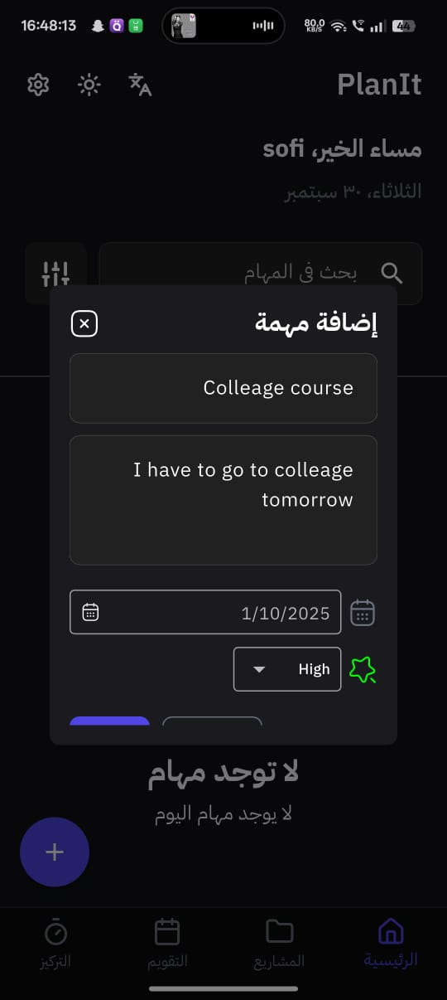
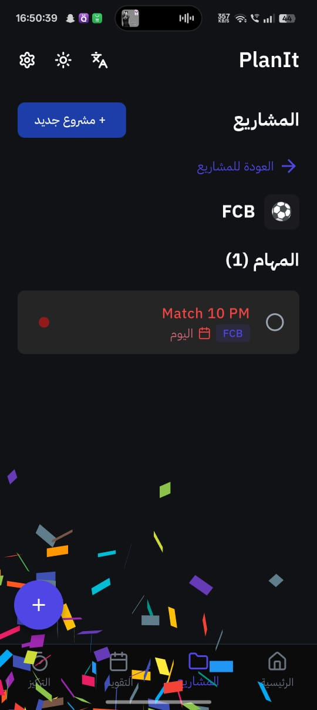
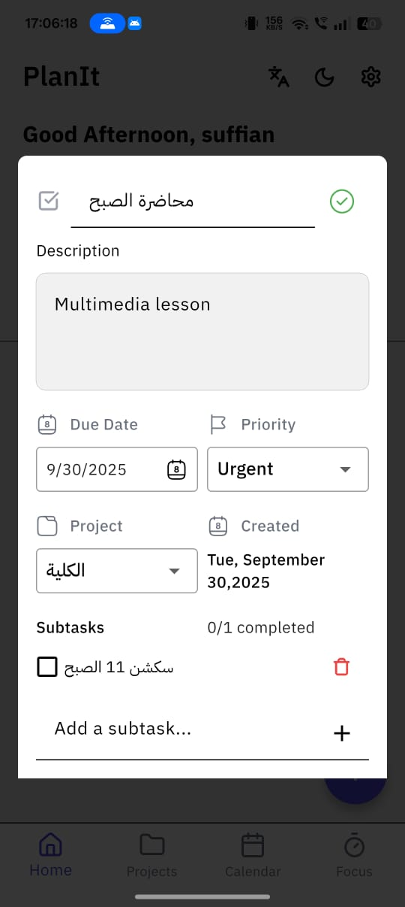
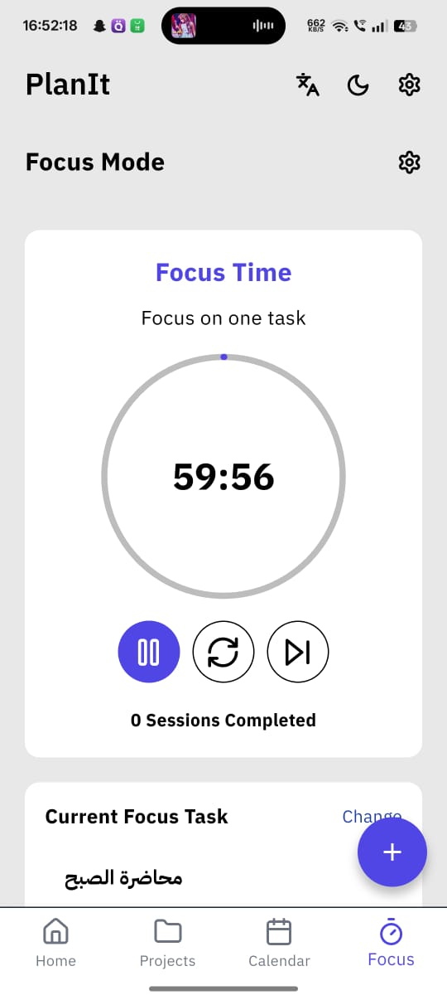

# PlanIt 🗓️  

**PlanIt** is a modern **To-Do & Project Management app** built with Flutter.  
It helps you stay productive by organizing tasks, managing projects, and focusing on what matters.  

---

## ✨ Features  

### 📝 Task Management (CRUD)  
- Add new tasks with title, description, and deadline.  
- Edit tasks to keep information up to date.  
- Delete tasks you don’t need anymore.  
- View all your tasks in a clean, structured list.  

### 📅 Calendar View  
- Visualize tasks directly on a calendar.  
- See which days have tasks at a glance.  
- Plan your week and month more effectively.  

### 🔍 Dynamic Search  
- Quickly search tasks by keywords.  
- Real-time search results as you type.  
- Makes it easy to find tasks in large lists.  

### 🎨 Theming  
- Supports both light and dark themes.  
- Matches your system preferences.  
- Gives a modern, personalized look.  

### 🌍 Localization  
- Multi-language support.  
- Switch between languages effortlessly.  
- Designed for global accessibility.  

### 📂 Project Manager  
- Group tasks under different projects.  
- Each project has its own dedicated task list.  
- Perfect for separating work, study, or personal goals.  

### 🗂️ Task Filters  
- **Today**: view tasks due today.  
- **Upcoming**: view tasks scheduled for the future.  
- **All**: view all tasks across projects.  

### 🎯 Focus Mode & Timer  
- Select a single task to focus on.  
- Built-in timer for focus sessions.  
- Helps boost concentration and productivity.  

### 💾 Hive Local Storage  
- Offline-first with **Hive** local database.  
- Fast, lightweight, and persistent storage.  
- Keeps your tasks available anytime without internet.  

### 💎 Modern UI  
- Clean, intuitive, and responsive design.  
- Smooth animations and user-friendly navigation.  
- Optimized for a modern productivity experience.  

---

## 🛠️ Tech Stack  

- **Flutter** – Cross-platform UI framework.  
- **Hive** – Local NoSQL storage.  
- **Cubit (Flutter Bloc)** – State management.  

---

## 📸 Screenshots  

Replace each placeholder with your actual screenshots:  

- **Splash Screen**  
    

- **Home Screen**  
    

- **Calendar Screen**  
    

- **Add Todo**  
    

- **Add Todo To Project**  
    

- **Edit Todo Screen**  
    

- **Focus Mode Screen**  
    

- **Projects Page**  
    

- **Note Details**  
    

---
