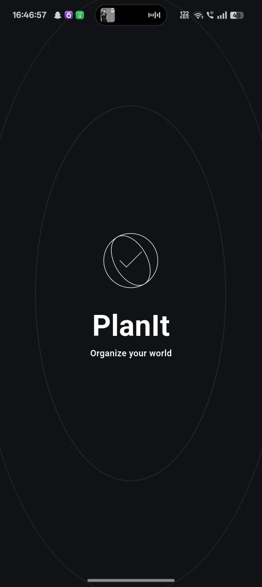
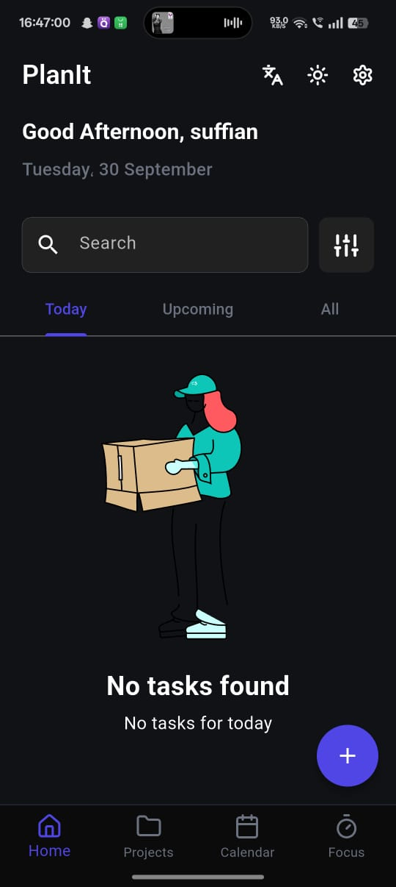
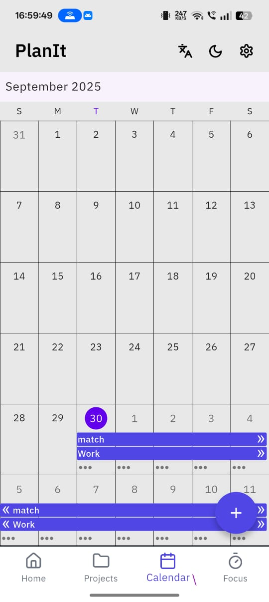
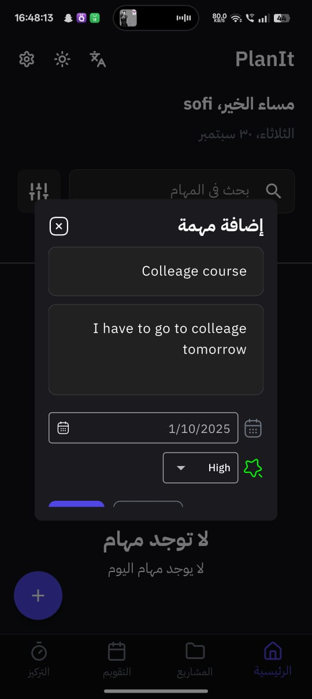
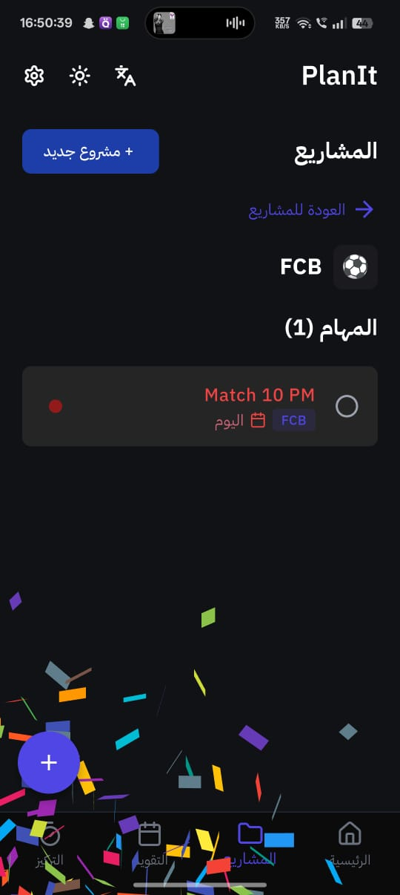
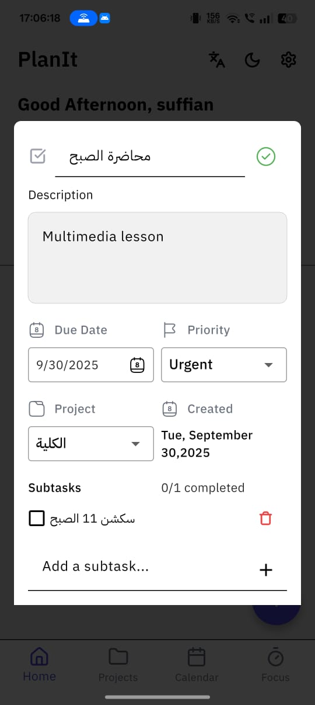
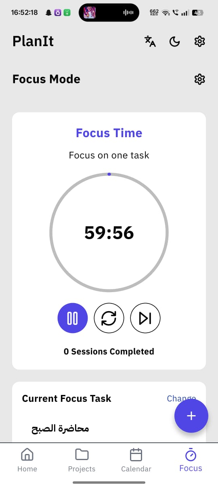
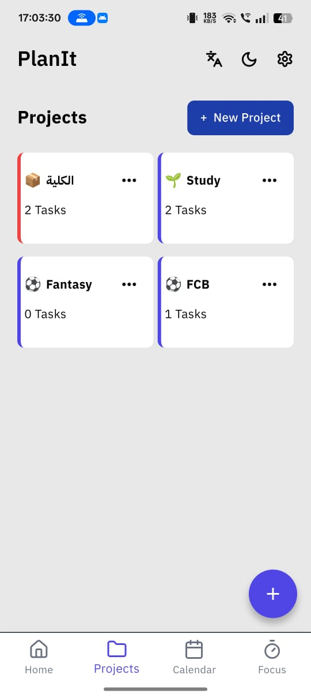
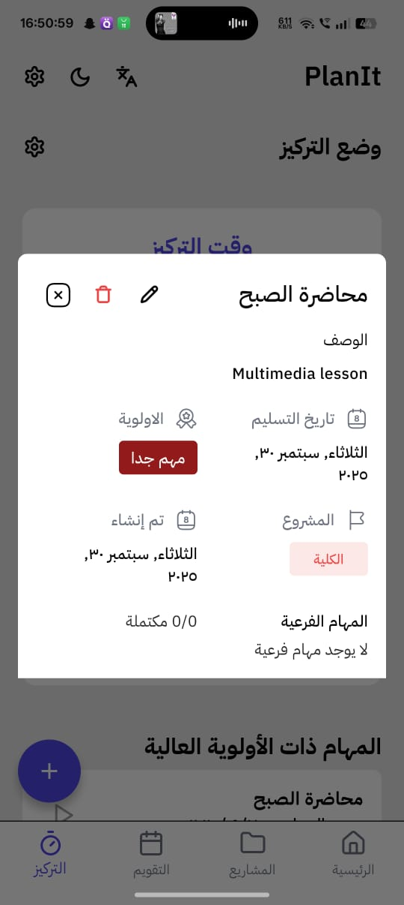

# PlanIt

PlanIt is a modern To-Do and Project Management application built with Flutter. It is designed to enhance productivity by organizing tasks, managing projects, and providing focus tools in a clean, offline-first environment.

## Features

* **Task Management (CRUD):** Create, read, update, and delete tasks with titles, descriptions, and deadlines.
* **Project Manager:** Group tasks into dedicated projects to separate work, study, or personal goals.
* **Calendar & Filters:** Visualize tasks on a dynamic calendar and filter them by Today, Upcoming, or All across projects.
* **Focus Mode & Timer:** Select a specific task and use the built-in timer for dedicated focus sessions.
* **Dynamic Search:** Real-time search functionality to quickly locate tasks within large lists.
* **Offline-First Storage:** Powered by Hive for fast, lightweight, and persistent local data availability without internet access.
* **Theming & Localization:** Full support for system-matched light/dark modes and multi-language accessibility.
* **Modern UI:** Clean, responsive design with smooth animations and intuitive navigation.

## Tech Stack

* **Framework:** Flutter / Dart
* **State Management:** Cubit (BLoC)
* **Local Storage:** Hive (NoSQL)

## 📸 Screenshots  

- **Splash Screen**  
    

- **Home Screen**  
    

- **Calendar Screen**  
    

- **Add Todo**  
    

- **Add Todo To Project**  
    

- **Edit Todo Screen**  
    

- **Focus Mode Screen**  
    

- **Projects Page**  
    

- **Note Details**  
    

---
